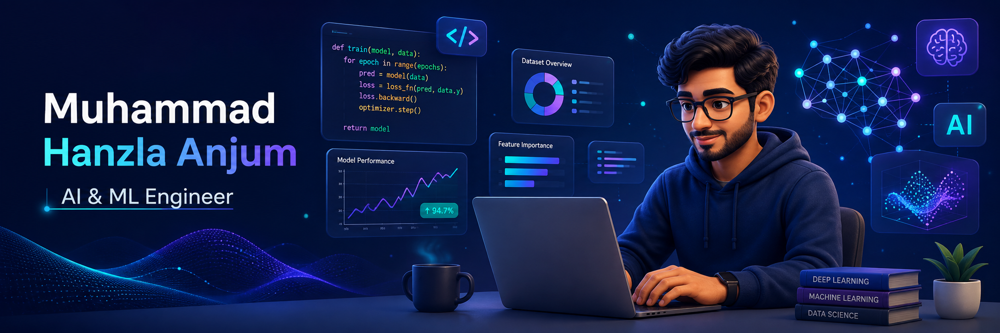

  

# 💫 About Me
🔭 I’m currently working on AI & Machine Learning projects, turning models into practical applications 📚 I’m currently learning and exploring Machine Learning & Deep Learning ⚡ In my free time, I experiment with AI ideas, build ML projects, and explore new technologies

## 🌐 Socials

&nbsp;&nbsp;

&nbsp;&nbsp;

<!-- Portfolio — uncomment when ready

-->

## 🛠️ Tech Stack

### 💻 Languages

  
  &nbsp;&nbsp;
  
  &nbsp;&nbsp;
  
  &nbsp;&nbsp;
  

### 🤖 AI & Machine Learning

  
  &nbsp;&nbsp;
  
  &nbsp;&nbsp;
  
  &nbsp;&nbsp;
  
  &nbsp;&nbsp;
  
  &nbsp;&nbsp;
  

### 📊 Data & Visualization

  
  &nbsp;&nbsp;
  
  &nbsp;&nbsp;
  
  &nbsp;&nbsp;
  
  &nbsp;&nbsp;
  
  &nbsp;&nbsp;
  

### ⚙️ Backend & AI Apps

  
  &nbsp;&nbsp;
  
  &nbsp;&nbsp;
  
  &nbsp;&nbsp;
  

### 🧰 Tools & Deployment

  
  &nbsp;&nbsp;
  
  &nbsp;&nbsp;
  
  &nbsp;&nbsp;
  
  &nbsp;&nbsp;
  

<h2>🚀 Featured Projects</h2>

<table>
<tr>
<td width="33%" align="center"><h3>🛡️ VeriSafe</h3></td>
<td width="33%" align="center"><h3>🎭 ReviewsLens</h3></td>
<td width="33%" align="center"><h3>🎬 Akinema</h3></td>
</tr>
<tr>
<td align="center" valign="top">
Deep learning-powered Django app for 
<strong>phishing URL</strong> and <strong>AI-generated voice detection.</strong>
</td>
<td align="center" valign="top">
ML-powered sentiment analyzer for 
<strong>positive and negative movie review classification.</strong>
</td>
<td align="center" valign="top">
Content-based movie recommender 
that suggests <strong>similar movies based on a user's selection.</strong>
</td>
</tr>
<tr>
<td align="center">

</td>
<td align="center">

</td>
<td align="center">

</td>
</tr>
<tr>
<td align="center">
 

  
</td>
<td align="center">
 

  
</td>
<td align="center">
 

  
</td>
</tr>
</table>

# 📊 GitHub Stats:

&nbsp;

 

